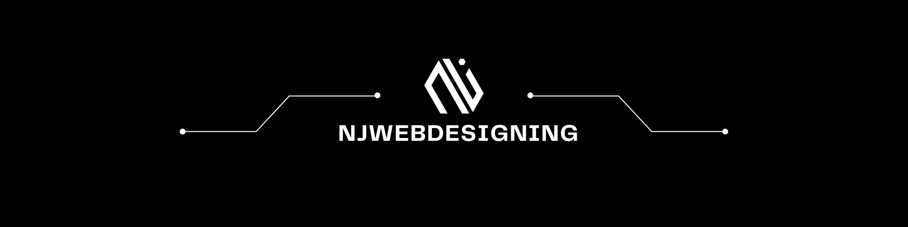

<div align="center">



<br>

# Hello, I'm Jagganraj 👋
### Freelance Web Developer · UI/UX Designer · Cybersecurity Enthusiast

<br>

<a href="https://njwebdesigning.in">

</a>
<a href="mailto:njwebdesigning@gmail.com">

</a>
<a href="https://github.com/JAGGANRAJ27">

</a>
<br><br>


</div>

---

<div align="center">

## 👨‍💻 About Me

</div>

I'm **Jagganraj**, a freelance web developer and UI/UX designer from **Salem, Tamil Nadu, India 🇮🇳**.

Exploring the intersection of **web development, design, cybersecurity, artificial intelligence, and automation**.
I enjoy taking ideas from a simple concept and turning them into functional, polished digital products.

```javascript
const jagganraj = {
    name: "Jagganraj",
    location: "Salem, Tamil Nadu, India",

    role: [
        "Freelance Web Developer",
        "UI/UX Designer",
        "Cybersecurity Enthusiast"
    ],

    education: [
        "BSc IT"
        "MCA"
    ],

    brands: [
        "NJWEBDESIGNING",
        "JOID Design Studio"
    ],

    interests: [
        "Web Development",
        "UI/UX Design",
        "Cybersecurity",
        "Artificial Intelligence",
        "Automation",
        "IoT"
    ],

    currentlyLearning: [
        "Java",
        "Data Structures & Algorithms",
        "Cybersecurity",
        "AI / ML"
    ],

    philosophy: "Build. Learn. Create. Repeat."
};
```

---


## ⚡ What I Do

| 🌐 Web Development | 🎨 UI/UX & Design | 🔐 Cybersecurity | 🤖 Exploring |
|:---|:---|:---|:---|
| • WordPress | • Figma | • Network Security | • Artificial Intelligence |
| • Elementor | • UI Design | • Ethical Hacking | • Machine Learning |
| • React | • UX Design | • Web Security | • Local AI |
| • MERN Stack | • Design Systems | • Phishing Detection | • Automation |
| • Laravel | • Landing Pages | • Linux Security | • n8n |
| • PHP | • Brand Identity | • Wazuh | • IoT |
| • Responsive Websites | • Graphic Design | • Security Labs | • Embedded Systems |
| • Business Websites | • Prototyping | • Security Research | • AI Applications |
| • Web Applications | • Creative Interfaces | | |

<div align="center">

## 🛠️ Tech Stack

<br>

<table>
<tr>
<td align="center" width="50%">

### 💻 Languages


</td>

<td align="center" width="50%">

### ⚛️ Development


</td>
</tr>

<tr>
<td align="center" width="50%">

### 🗄️ Database & Backend


</td>

<td align="center" width="50%">

### 🎨 Design


</td>
</tr>

<tr>
<td align="center" width="50%">

### ⚙️ Tools & Platforms


</td>

<td align="center" width="50%">

### ☁️ Cloud & Security


</td>
</tr>
</table>

</div>
<div align="center">

## 📚 Currently Learning

<br>


</div>

---

<div align="center">

## 🚀 Featured Projects

</div>

<table align="center">
<tr>

<td width="50%" align="center" valign="top">

### 🤖 Tini

A personal AI/IoT companion project exploring physical interaction, embedded systems and intelligent interfaces.

<br><br>

<a href="https://github.com/JAGGANRAJ27/Tini">

</a>

</td>

<td width="50%" align="center" valign="top">

### 🌐 Webly

A web development project focused on building modern digital experiences.

<br><br>

<a href="https://github.com/JAGGANRAJ27/Webly">

</a>

</td>

</tr>
</table>

---

<div align="center">

## 🤖 Hector

<br>


<br><br>


</div>

### 🧠 About Hector

**Hector** is an experimental personal AI/IoT companion project.

The project explores the interaction between software, embedded hardware, displays, sensors and AI.

```text
                         ┌───────────────────┐
                         │      HECTOR       │
                         │                   │
                         │   Vision          │
                         │   Interaction     │
                         │   Intelligence    │
                         │   Display         │
                         │   ESP32           │
                         └─────────┬─────────┘
                                   │
                            ┌──────▼──────┐
                            │    TINI     │
                            └─────────────┘
```

---

<div align="center">

## 📊 GitHub Statistics

<br>


</div>

<div align="center">

## 🎓 Certifications

<br>


</div>

---

<div align="center">

## 🎬 YouTube
### Code · Design · Cybersecurity · AI

<p>
Sharing projects, experiments, tutorials and things I'm learning.
</p>
<a href="https://www.youtube.com/@njwebdesigning">

</a>

</div>

---

<div align="center">

## 💼 Services

<br>

<table>
<tr>

<td align="center" width="33%" valign="top">

### 🌐 WEB DEVELOPMENT

WordPress,
React,
Laravel,
MERN,
Landing Pages,
Business Websites

</td>

<td align="center" width="33%" valign="top">

### 🎨 DESIGN

UI/UX,
Figma,
Branding,
Graphic Design,
Design Systems,
Prototypes

</td>

<td align="center" width="33%" valign="top">

### 🔐 SECURITY

Web Security,
Network Security,
Phishing Detection,
Linux Security,
Security Research

</td>

</tr>
</table>

</div>

---

<div align="center">

## 🌍 Let's Connect

<a href="https://njwebdesigning.in">

</a>
<a href="mailto:contact@njwebdesigning.in">

</a>
<a href="https://github.com/JAGGANRAJ27">

</a>

</div>

---

<div align="center">

## Have an idea?
### Let's build something awesome together. 🚀

`BUILD • LEARN • CREATE • REPEAT`


**© 2026 Jagganraj**
</div>
